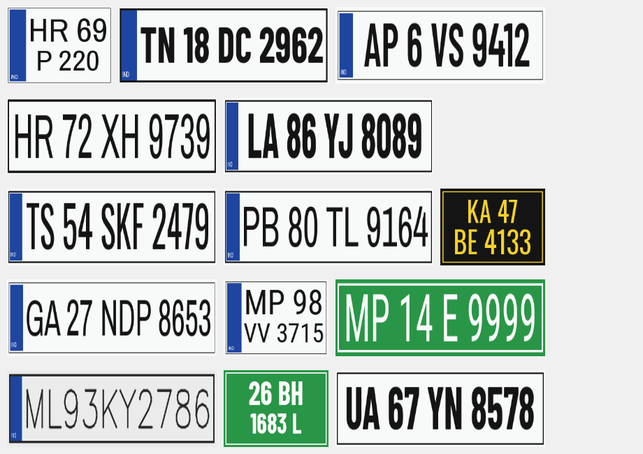
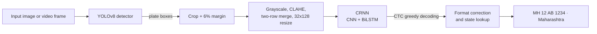

# Netra — Automatic Number Plate Recognition for Indian Vehicles

**Automatic Number Plate Recognition for Indian Vehicles Using YOLOv8 and a CRNN-Based OCR**

Netra (Sanskrit for *eye*) reads registration numbers from photos and videos of Indian vehicles.
It is a two-stage deep learning system: a YOLOv8 detector finds each plate, and a CRNN
(convolutional + recurrent network trained with CTC loss) reads the characters. A rule-based
corrector then validates the result against the official Indian plate format and identifies the
state of registration. Everything runs through a Streamlit dashboard.


*Examples of the synthetic plates rendered to train the character reader.*

---

## Features

- Detects multiple plates per image with a fine-tuned YOLOv8 model
- Reads single-row (cars) and two-row (bikes, autos, trucks) plates
- Handles white, yellow, green (EV), black (rental) and Bharat-series (BH) plates
- Corrects look-alike OCR errors (`O/0`, `B/8`, `I/1`, `S/5`) using the Indian plate layout
- Maps state codes to state / union territory names (MH → Maharashtra)
- Dashboard with single image, video, batch and session-log views, plus CSV export
- Sign-in page with hashed passwords and lockout after repeated failures
- Command-line tool for images, folders and videos
- EasyOCR baseline included for comparison in the results chapter

## How it works



**Stage 1 — Detection.** YOLOv8n, pretrained on COCO, is fine-tuned on Indian and international plate
images from Kaggle. Transfer learning lets a few thousand images reach high accuracy.

**Stage 2 — Recognition.** A CRNN reads the cropped plate:

| Block | Layers | Output |
|---|---|---|
| Input | grayscale crop | 1 × 32 × 128 |
| CNN | 6 × (Conv 3×3 → BatchNorm → ReLU), 4 max-pools | 512 × 2 × 32 |
| Collapse | adaptive average pool over height | 32 time steps × 512 |
| RNN | 2-layer bidirectional LSTM, 256 units per direction | 32 × 512 |
| Classifier | Linear → log-softmax | 32 × 37 (0–9, A–Z, blank) |

The network is trained with **CTC loss**, so labels are just the plate strings and no per-character
positions are needed. Training data is 40,000 synthetic plates with heavy augmentation (perspective
tilt, motion blur, low resolution, noise, shadows, JPEG compression), plus optional real labelled crops.

**Stage 3 — Post-processing.** Indian plates follow `SS DD XX NNNN` (state, district, series, number)
or `YY BH NNNN XX`. The corrector tries every valid split of the OCR output, swaps look-alike
characters where a position requires a letter or digit, and keeps the most plausible result.

## Deep learning concepts covered

| Syllabus topic | Where it appears |
|---|---|
| Convolutional neural networks | YOLOv8 backbone, CRNN feature extractor (`netra/ocr/model.py`) |
| Batch normalisation, ReLU, pooling, dropout | CRNN blocks |
| Transfer learning and fine-tuning | `scripts/train_detector.py` |
| Object detection: anchors, IoU, NMS, mAP | YOLOv8 training and evaluation |
| Recurrent networks (LSTM, bidirectional) | CRNN sequence model |
| Sequence labelling with CTC loss | `scripts/train_ocr.py`, `netra/ocr/charset.py` |
| Data augmentation and synthetic data | `netra/ocr/dataset.py`, `netra/ocr/synth.py` |
| Optimisers and LR schedules | AdamW with One-Cycle schedule, gradient clipping |
| Evaluation metrics | mAP@0.5, precision, recall, character error rate, plate accuracy |

## Project structure

```
netra-anpr/
├── app/
│   ├── main.py               Entry point: page settings and routing
│   ├── views/
│   │   ├── login.py          Login page        (/)
│   │   └── dashboard.py      Dashboard page    (/dashboard)
│   ├── auth.py               Password hashing and session helpers
│   ├── components.py         HTML components (plate readout, bars, timings)
│   └── theme.css             Dashboard styling
├── netra/                    Core Python package
│   ├── config.py             Loads config.yaml
│   ├── detector.py           YOLOv8 wrapper
│   ├── preprocess.py         Crop enhancement and resizing
│   ├── postprocess.py        Indian format correction
│   ├── states.py             State / UT code table
│   ├── pipeline.py           Detector + reader + corrector
│   ├── visualize.py          Draws boxes and labels
│   ├── metrics.py            CER and plate accuracy
│   └── ocr/
│       ├── model.py          CRNN network
│       ├── charset.py        Alphabet and CTC decoding
│       ├── synth.py          Synthetic plate renderer
│       ├── dataset.py        Dataset and augmentations
│       └── recognizer.py     Inference wrapper (CRNN / EasyOCR)
├── scripts/
│   ├── download_dataset.py   1. Download Kaggle datasets
│   ├── prepare_dataset.py    2. Convert to YOLO format
│   ├── train_detector.py     3. Train YOLOv8
│   ├── generate_plates.py    4. Render synthetic plates
│   ├── train_ocr.py          5. Train CRNN
│   ├── evaluate.py           6. Evaluate both models
│   ├── create_user.py        Add or remove dashboard accounts
│   └── infer.py              Run on images, folders or videos
├── notebooks/
│   └── train_on_colab.ipynb  End-to-end training on a free Colab GPU
├── tests/                    Unit tests (pytest)
├── models/                   Trained weights
├── data/                     Datasets (not committed, see data/README.md)
├── config.yaml               All paths and hyper-parameters
└── requirements.txt
```

## Datasets

| Dataset | Images | Format | Use |
|---|---|---|---|
| [Indian vehicle number plate YOLO annotation](https://www.kaggle.com/datasets/deepakat002/indian-vehicle-number-plate-yolo-annotation) | Indian vehicles | YOLO | Detector |
| [Car License Plate Detection](https://www.kaggle.com/datasets/andrewmvd/car-plate-detection) | 433 | Pascal VOC | Detector |
| Synthetic Indian plates (generated) | 44,000 | image + text | Character reader |

The preparation script reads both annotation formats, removes duplicate images and creates an
85 / 10 / 5 train / validation / test split.

## Getting started

### 1. Install

```bash
git clone https://github.com/katkarvismaya19-web/netra-anpr.git
cd netra-anpr
python -m venv .venv
source .venv/bin/activate        # Windows: .venv\Scripts\activate
pip install -r requirements.txt
```

Python 3.10 or newer is required.

### 2. Train the models

A GPU is strongly recommended. The easiest route is the Colab notebook:
open `notebooks/train_on_colab.ipynb` in Google Colab, select a T4 GPU and run all cells. It downloads
the data, trains both models and gives you a zip with the weights to extract into this folder.

To train locally instead, set up your Kaggle API token
(kaggle.com → Settings → API → Create New Token, then place `kaggle.json` in `~/.kaggle/`) and run:

```bash
python scripts/download_dataset.py
python scripts/prepare_dataset.py
python scripts/train_detector.py
python scripts/generate_plates.py
python scripts/train_ocr.py
python scripts/evaluate.py --detector --ocr data/ocr/synthetic/val
```

### 3. Launch the dashboard

```bash
streamlit run app/main.py
```

Open http://localhost:8501. The app has two pages:

| Page | Address | Who can open it |
|---|---|---|
| Login | http://localhost:8501/ | Everyone |
| Dashboard | http://localhost:8501/dashboard | Signed-in users only; others are sent to the login page |

The trained model files go in the `models/` folder; until they are there, uploads show a short message instead of results.

### Signing in

The app opens on the login page; the dashboard is a separate page that is only reachable after logging in. Passwords are stored only as salted PBKDF2-SHA256 hashes in
`.streamlit/secrets.toml`, which is excluded from git. After five wrong attempts the form locks for
60 seconds.

```bash
python scripts/create_user.py admin --name "Traffic Control Room"   # create or update
python scripts/create_user.py admin --delete                        # remove
```

Until an account is created, a demo account works: username `admin`, password `netra@2026`.
As soon as you create your own account, the demo account stops working. Sessions end when the
browser tab is closed or refreshed, so you sign in again each time.

<!-- After training, save screenshots of your running app as docs/images/login.png and
docs/images/dashboard.png, then remove these comment markers to show them here.

| Sign-in page | Dashboard |
|---|---|
|  |  |
-->

### Command line

```bash
python scripts/infer.py samples/car.jpg              # one image
python scripts/infer.py samples/                     # a folder
python scripts/infer.py traffic.mp4 --stride 5       # a video
python scripts/infer.py plate.png --crop             # an already-cropped plate
```

Annotated outputs and a `results.csv` are written to `outputs/predictions/`.

### Tests

```bash
pytest -q
```

## Results

Fill this table in after training (values are printed by `scripts/evaluate.py` and saved in
`outputs/evaluation.json`).

| Model | Metric | Value |
|---|---|---|
| YOLOv8n detector | mAP@0.5 (test) | |
| | mAP@0.5:0.95 (test) | |
| | Precision / Recall | |
| CRNN reader | Plate accuracy (synthetic val) | |
| | Plate accuracy after format correction | |
| | Character error rate | |
| EasyOCR baseline | Plate accuracy (same set) | |
| Pipeline | Average latency per image | |

## Configuration

Every path and hyper-parameter is in `config.yaml`: detector epochs, image size and thresholds,
CRNN size, learning rate and number of synthetic plates, and the video frame stride used in the
dashboard. Command-line flags on each script override these values for a single run.

## Limitations and future work

- The reader is trained mainly on synthetic data; labelling a few hundred real crops
  (see `data/README.md`) typically improves accuracy on photographs.
- Hand-painted and heavily stylised plates remain difficult.
- Hindi or regional-script plates are not supported.
- Possible extensions: vehicle tracking across frames (ByteTrack), attention-based decoders,
  quantised models for edge devices such as a Raspberry Pi or Jetson Nano.

## References

1. B. Shi, X. Bai, C. Yao, "An End-to-End Trainable Neural Network for Image-Based Sequence
   Recognition and Its Application to Scene Text Recognition," *IEEE TPAMI*, 2017.
2. A. Graves et al., "Connectionist Temporal Classification: Labelling Unsegmented Sequence Data
   with Recurrent Neural Networks," *ICML*, 2006.
3. J. Redmon et al., "You Only Look Once: Unified, Real-Time Object Detection," *CVPR*, 2016.
4. G. Jocher et al., *Ultralytics YOLOv8*, 2023. https://github.com/ultralytics/ultralytics
5. K. Zuiderveld, "Contrast Limited Adaptive Histogram Equalization," *Graphics Gems IV*, 1994.
6. Ministry of Road Transport and Highways, Central Motor Vehicles Rules — registration mark formats.

## Licence

Code released under the MIT licence (see `LICENSE`). Datasets remain under their original Kaggle
licences. Fonts used for synthetic plates are from Google Fonts under the SIL Open Font Licence.

## Author

[Your Name] — [College Name], Department of [Branch], [Year]
